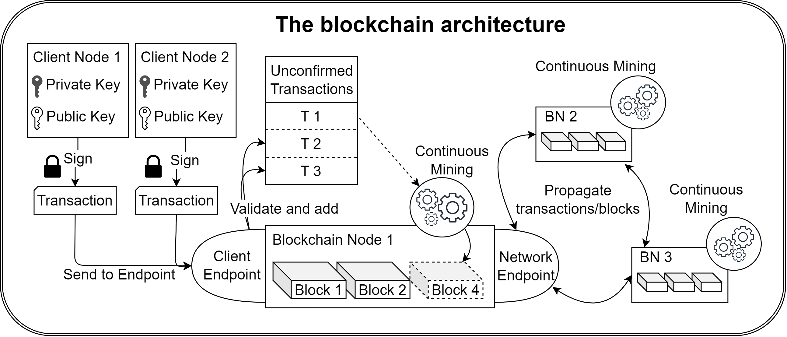

# quantumsafe-blockchain-project

## Build and install OpenQuantumSafe library (liboqs)

### liboqs
This project uses liboqs for quantum-safe algorithms, which needs to be build before.
This can be done following these steps: https://github.com/open-quantum-safe/liboqs#quickstart
### liboqs-python
To use the C library liboqs, a python-wrapper for this lib needs to be installed.
Depending on the OS, the manual can be found here: https://github.com/open-quantum-safe/liboqs-python#installation

## Python blockchain implementation
### Implemented ciphers
Dilithium-3, RSA 3072, ECC P-256
### Setup
1. Install requirements:
    ````
    pip install -r requirements.txt
    ````
2. Start docker service
3. Start test via docker-runny script or through the Node application
    ````
   python docker-runner.py CIPHER N_TRANSACTIONS USE_CACHE_BOOLEAN BLOCK_SIZE
   e.g. python docker-runner.py dilithium 1000 false 9
    ````

### Architecture overview

